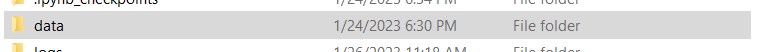
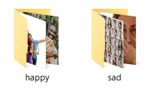
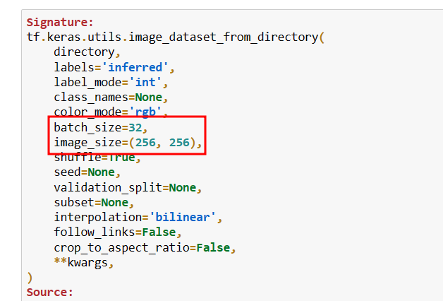
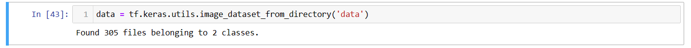
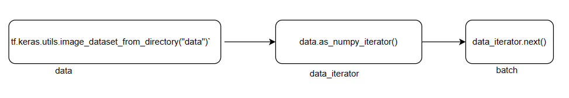
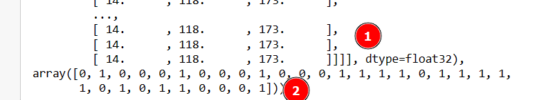
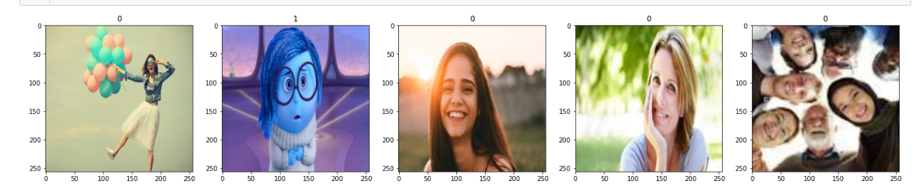
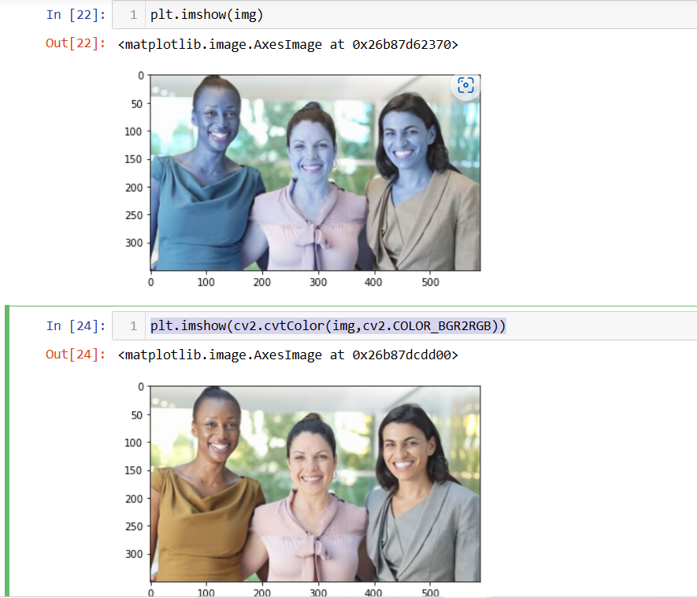
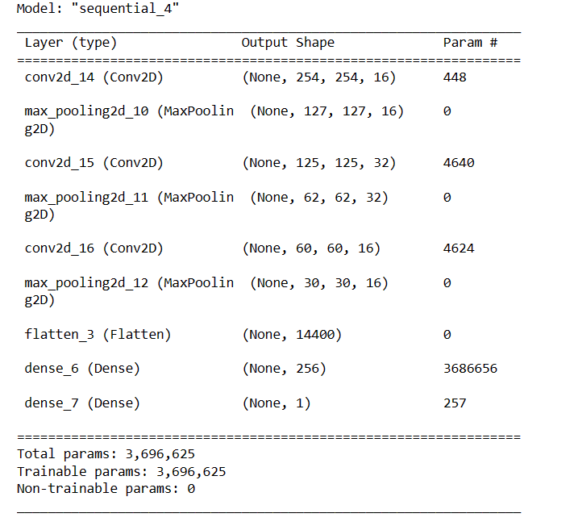
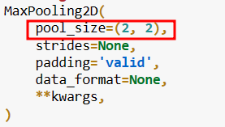

<a link ="https://www.youtube.com/watch?v=jztwpsIzEGc&t=30s"> Inspired By Nicholas Renotte </a> This project classifies the image as a sad/happy one
## Installing the dependencies
`conda create -n happy`
`pip install tensorflow tensorflow-gpu opencv-python matplotlib`

## The accuracy 


There is no overfitting on this data
## Testing with the data


## Loading the data 
Loading the data is an integral part for the image classification 
I got an oppurtunity to learn about Tensorflow in a practical manner with this project.
**Directory Structure**


- 153 photos on happy folder
- 152 photos on sad folder

`tf.keras.utils.image_dataset_from_directory??`

`tf.keras.utils.image_dataset_from_directory('data')`
> retrieves all the data(*image only*) that can be found on this directory

On this we will be working on a batch manner

```
# 32 batch image of 256*256 having 3 chanels (RGB) is taken
batch[0].shape
```
>(32, 256, 256, 3)

-  1 is batch[0] 
-  2 is batch[1]
```
#Plotting the data
fig , ax = plt.subplots(ncols=5,figsize=(24,24))
for idx, img in enumerate(batch[0][:5]):
    ax[idx].imshow(img.astype(int))
    ax[idx].title.set_text(batch[1][idx])
```

`if plt.imshow()was used on the loop only the last indexed photo would  have been displayed over`
# cv2.imread()
plotting with cv2 will  post a BGR image which needs to be converted using RGB
`plt.imshow(cv2.cvtColor(img,cv2.COLOR_BGR2RGB))`

# Scaling the data
`data = data.map(lambda x,y: (x/255,y))`
For faster operation of the data
`len(data)` gives 10 thus there are 10 batch each of 32 size
- `model.add(Conv2D(16, (3,3), 1, activation='relu', input_shape=(256,256,3)))` means that **16** 3*3 filters of RGB(3) channels have stride =1 
>  $$\lfloor \frac{n-f+2p}{s} +1\rfloor$$
> Here n = 256 ,f =3 ,p =0 ,s=1
>  $$\lfloor \frac{256-3}{1} +1\rfloor$$ 
>  254 is used another layer's width

**Parameters**
- First parameter =
$$ ((3*3*3)+1)*16 = 448$$


-  For **maxpooling** 
-  $$\lfloor \frac{254}{2}\rfloor =127$$ 
- There wont be parameter for the max pooling.
## For second conv2D
`model.add(Conv2D(32,(3,3),1,activation='relu'))
`
means that **32** 3*3 filters of RGB(3) channels have stride =1 
-  $$\lfloor \frac{n-f+2p}{s} +1\rfloor$$
- Here n = 127 ,f =3 ,p =0 ,s=1
-  $$\lfloor \frac{127-3}{1} +1\rfloor$$ 
-  125 is the width and height of its output layer
-  The chanels would be 32
-  Hence, the output shape =(None,125,125,32)
**Parameters**
$$ ((f_{H}*f_{W}*n^{[C-1]})+1)*n^{[C]} $$
$$((3*3*16)+1)*32=4640$$
### For max pooling
-  $$\lfloor \frac{125}{2}\rfloor =62$$ 
## For third conv2D
`model.add(Conv2D(64,(3,3),1,activation='relu'))
`
means that **64** 3*3 filters of RGB(3) channels have stride =1 
-  $$\lfloor \frac{n-f+2p}{s} +1\rfloor$$
- Here n = 62 ,f =3 ,p =0 ,s=1
-  $$\lfloor \frac{62-3}{1} +1\rfloor$$ 
-  60 is the width and height of its output layer
-  The chanels would be 64
-  Hence, the output shape =(None,60,60,64)
**Parameters**
$$ ((f_{H}*f_{W}*n^{[C-1]})+1)*n^{[C]} $$
$$((3*3*32)+1)*64=18496$$
### For max pooling
-  $$\lfloor \frac{60}{2}\rfloor =30$$ 

## Flatten
`model.add(Flatten())`
 $$30*30*64=57600$$
## Dense
`model.add(Dense(256,activation='relu'))`
$$57600*256+256=14745856$$
## Final Dense Layer
`model.add(Dense(1,activation='sigmoid'))`
$$256*1+1=257$$


